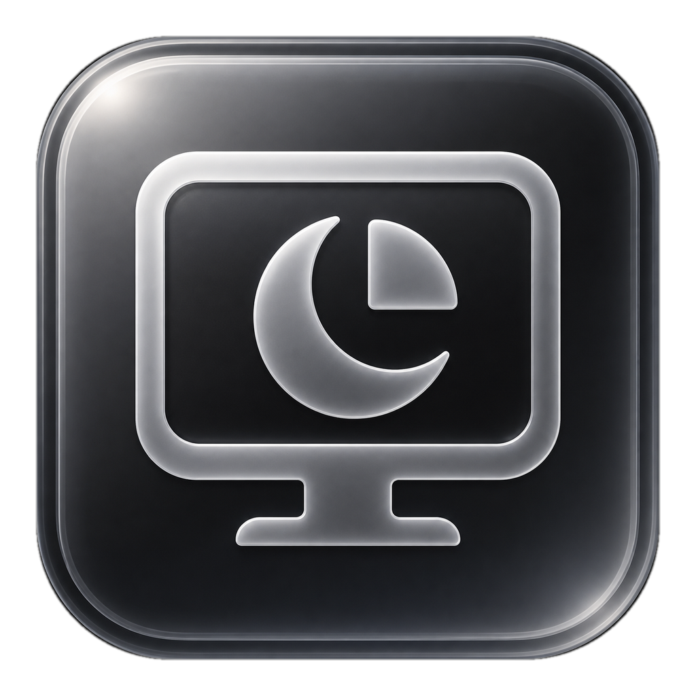

<p align="center">
  
</p>

# Screen Timeout Glass

A small Windows desktop bar for changing when your screen turns off.

Click one of three buttons:

- **1min**
- **5min**
- **1H**

The app changes the plugged-in screen timeout for the active Windows power plan. It does not change battery settings.

## Download

[Download the Windows x64 portable app](https://github.com/hybtc8888/screen-timeout-glass/releases/latest)

No installer is needed. The app stays out of the taskbar and can be opened from the system tray.

## Use

- Click a button to set the timeout.
- Drag the bar from an edge or empty space.
- Right-click for startup, refresh, and exit options.
- Click the tray icon to show or hide the bar.

## Build

Windows x64 and Node.js 22.12+ are required.

```powershell
npm ci
npm test
npm run dist
```

The output is a Windows x64 portable `.exe`.

## License

No license has been added yet.
